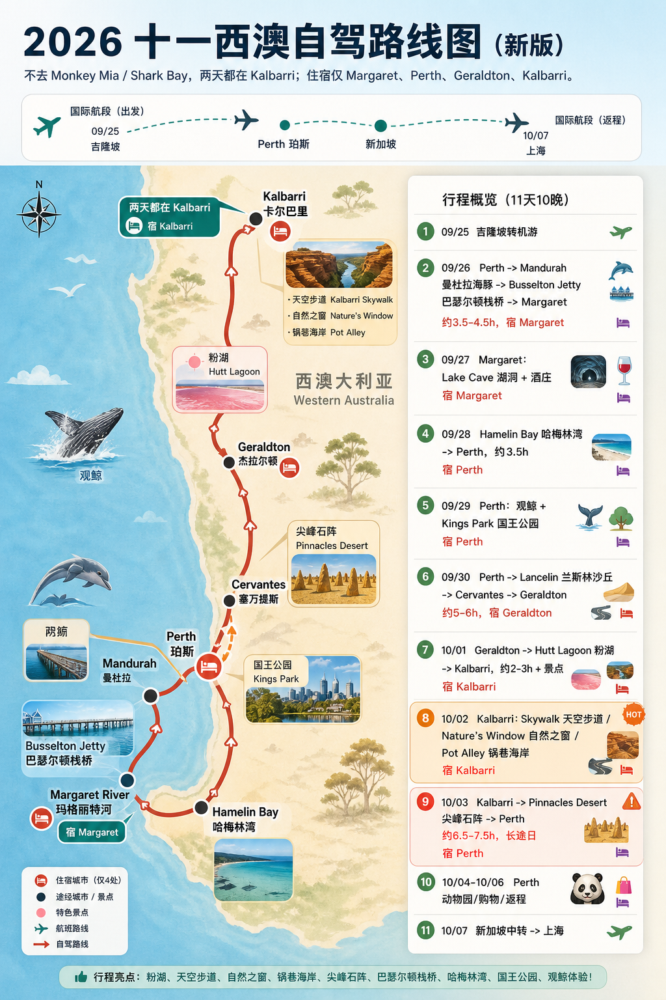

# 2026 十一西澳自驾完整攻略

## 行程结论

新版行程不去 Monkey Mia / Shark Bay，两天都在 Kalbarri。住宿固定在 Margaret、Perth、Geraldton、Kalbarri 四个地点。整体比原方案更稳，10/03 仍是长途日。

## 住宿点

- Margaret：南线酒庄/洞穴基地
- Perth：返程与补给基地
- Geraldton：北上中转住宿
- Kalbarri：粉湖与峡谷两天基地

## 每日行程

### 09/25 周五｜吉隆坡转机一日游

- 路线：浦东 T2 → 吉隆坡 T2；吉隆坡包车一日游
- 住宿：飞机上/中转
- 车程：市区包车，景点较多
- 内容：保留粉红清真寺、国家清真寺、茨厂街/柏威年、双子塔夜景即可，小印度和蓝色清真寺看体力取舍。
- 注意：凌晨抵达后体力消耗大，行李寄存、入境、交通高峰都要留缓冲。
- 景点：粉红清真寺、小印度、国家清真寺、蓝色清真寺、茨厂街、双子塔

### 09/26 周六｜落地 Perth 后南下 Margaret

- 路线：Perth → Mandurah → Busselton Jetty → Margaret
- 住宿：Margaret
- 车程：约 3.5-4.5h 车程合计
- 内容：上午 Mandurah 海豚巡游，午后 Busselton Jetty，晚上入住 Margaret。
- 注意：Busselton Jetty 火车和水下观测站建议提前订；落地第一天不要再加支线。
- 景点：Mandurah 海豚、Busselton Jetty

### 09/27 周日｜Margaret 洞穴与酒庄

- 路线：Margaret 区域短距离移动
- 住宿：Margaret
- 车程：短途自驾
- 内容：Lake Cave + Voyager Estate / Leeuwin Estate / Vasse Felix。
- 注意：Lake Cave 有台阶，洞内偏凉；酒庄午餐和品酒要提前确认时段。
- 景点：Lake Cave、Voyager Estate、Leeuwin Estate

### 09/28 周一｜Hamelin Bay 后返回 Perth

- 路线：Margaret → Hamelin Bay → Perth
- 住宿：Perth
- 车程：约 3.5h 返回 Perth
- 内容：早上去 Hamelin Bay 看魔鬼鱼，下午回 Perth。
- 注意：魔鬼鱼是否靠岸看海况和运气，保持距离，不喂食不触摸。
- 景点：Hamelin Bay

### 09/29 周二｜Perth 观鲸与市区补给

- 路线：Perth 市区 / 近郊
- 住宿：Perth
- 车程：轻松日
- 内容：观鲸、市区游览、购物补给，傍晚 Kings Park 日落。
- 注意：观鲸受海况影响，留意改期和取消政策；这天适合补油、补水、采购干粮。
- 景点：Kings Park 日落

### 09/30 周三｜北上 Geraldton

- 路线：Perth → Lancelin → Cervantes → Geraldton
- 住宿：Geraldton
- 车程：约 5-6h 含停留
- 内容：Lancelin 沙丘、Cervantes 午餐/补给、Leaning Tree，晚上 Geraldton。
- 注意：这天开始进入长距离自驾，建议 9:30 前出发，避免夜路。
- 景点：Lancelin 沙丘、Pinnacles Desert

### 10/01 周四｜Kalbarri 第一天：粉湖与峡谷

- 路线：Geraldton → Hutt Lagoon → Kalbarri
- 住宿：Kalbarri
- 车程：约 2-3h + 景点
- 内容：Hutt Lagoon 粉湖、Kalbarri Skywalk、Nature’s Window；根据天气把 Pot Alley 留到傍晚或次日。
- 注意：粉湖晴天中午前后颜色更稳；峡谷区域防晒、带水、穿防滑鞋。
- 景点：Hutt Lagoon 粉湖、Kalbarri Skywalk、Nature’s Window、Pot Alley

### 10/02 周五｜Kalbarri 第二天：补完峡谷与海岸

- 路线：Kalbarri 区域
- 住宿：Kalbarri
- 车程：短途移动
- 内容：不去 Monkey Mia / Shark Bay，继续住 Kalbarri。补 Hutt Lagoon、Skywalk、Nature’s Window、Pot Alley，下午可镇上休整。
- 注意：这一天是新版行程的关键缓冲，遇到大风/高温可把峡谷徒步改成海岸线。
- 景点：Hutt Lagoon 粉湖、Kalbarri Skywalk、Nature’s Window、Pot Alley

### 10/03 周六｜Kalbarri 南下 Pinnacles 后回 Perth

- 路线：Kalbarri → Geraldton/Cervantes → Pinnacles Desert → Perth
- 住宿：Perth
- 车程：约 6.5-7.5h，长途日
- 内容：早出发南下，傍晚看 Pinnacles Desert 尖峰石阵，再回 Perth。
- 注意：这是全程最累驾驶日；少加支线，必要时把 Pinnacles 改成白天看，安全优先。
- 景点：Pinnacles Desert

### 10/04-10/06｜Perth 休整、动物园、购物返程

- 路线：Perth 市区
- 住宿：Perth / 10月6日飞新加坡
- 车程：轻松日
- 内容：Perth Zoo、购物、打包、机场还车。10/06 下午飞新加坡。
- 注意：动物园建议早上去；10/06 只排轻量购物和餐饮。
- 景点：Perth Zoo

### 10/07 周三｜新加坡中转后回上海

- 路线：新加坡樟宜 → 上海
- 住宿：返程
- 车程：中转约 5.5h
- 内容：优先 Jewel Changi 星耀樟宜；如果时间非常宽裕再考虑鱼尾狮公园。
- 注意：出入境和往返市区有风险，不建议把鱼尾狮作为必去。
- 景点：Jewel Changi、鱼尾狮公园

## 景点图片与攻略

### 粉红清真寺｜布城粉红清真寺

- 英文：Putra Mosque
- 看点：粉色穹顶和湖畔倒影，适合吉隆坡转机日打卡。
- 建议停留：45-60 分钟
- 链接：[小红书搜索](https://www.xiaohongshu.com/search_result?keyword=%E5%90%89%E9%9A%86%E5%9D%A1%20%E7%B2%89%E7%BA%A2%E6%B8%85%E7%9C%9F%E5%AF%BA%20%E8%BD%AC%E6%9C%BA%20%E6%94%BB%E7%95%A5)

### 小印度｜吉隆坡小印度

- 英文：Little India / Brickfields
- 看点：彩色街区和印度餐，适合短暂停留。
- 建议停留：30-45 分钟
- 链接：[小红书搜索](https://www.xiaohongshu.com/search_result?keyword=%E5%90%89%E9%9A%86%E5%9D%A1%20%E5%B0%8F%E5%8D%B0%E5%BA%A6%20Brickfields%20%E6%94%BB%E7%95%A5)

### 国家清真寺｜马来西亚国家清真寺

- 英文：National Mosque of Malaysia
- 看点：吉隆坡代表性现代清真寺，注意开放时段和着装。
- 建议停留：45 分钟
- 链接：[小红书搜索](https://www.xiaohongshu.com/search_result?keyword=%E5%90%89%E9%9A%86%E5%9D%A1%20%E5%9B%BD%E5%AE%B6%E6%B8%85%E7%9C%9F%E5%AF%BA%20%E6%94%BB%E7%95%A5)

### 蓝色清真寺｜莎阿南蓝色清真寺

- 英文：Sultan Salahuddin Abdul Aziz Mosque
- 看点：蓝色穹顶视觉很强，但离市区较远，转机日可作为取舍项。
- 建议停留：60-90 分钟
- 链接：[小红书搜索](https://www.xiaohongshu.com/search_result?keyword=%E5%90%89%E9%9A%86%E5%9D%A1%20%E8%93%9D%E8%89%B2%E6%B8%85%E7%9C%9F%E5%AF%BA%20%E8%8E%8E%E9%98%BF%E5%8D%97%20%E6%94%BB%E7%95%A5)

### 茨厂街｜吉隆坡唐人街

- 英文：Petaling Street
- 看点：吃饭和街区扫街方便，可和柏威年/双子塔前后衔接。
- 建议停留：45-60 分钟
- 链接：[小红书搜索](https://www.xiaohongshu.com/search_result?keyword=%E5%90%89%E9%9A%86%E5%9D%A1%20%E8%8C%A8%E5%8E%82%E8%A1%97%20%E7%BE%8E%E9%A3%9F%20%E6%94%BB%E7%95%A5)

### 双子塔｜吉隆坡双子塔

- 英文：Petronas Twin Towers
- 看点：转机日夜景收尾，适合放最后。
- 建议停留：45-60 分钟
- 链接：[小红书搜索](https://www.xiaohongshu.com/search_result?keyword=%E5%90%89%E9%9A%86%E5%9D%A1%20%E5%8F%8C%E5%AD%90%E5%A1%94%20%E5%A4%9C%E6%99%AF%20%E6%9C%BA%E4%BD%8D)

### Mandurah 海豚｜曼杜拉海豚巡游

- 英文：Mandurah Dolphins
- 看点：Perth 南下路上顺路，适合落地后轻量活动。
- 建议停留：1-1.5 小时
- 链接：[小红书搜索](https://www.xiaohongshu.com/search_result?keyword=%E8%A5%BF%E6%BE%B3%20Mandurah%20%E6%B5%B7%E8%B1%9A%20%E5%B7%A1%E6%B8%B8)

### Busselton Jetty｜巴瑟尔顿栈桥

- 英文：Busselton Jetty
- 看点：1.8km 长栈桥、观光小火车和水下观测站。
- 建议停留：1.5-3 小时
- 链接：[官网](https://busseltonjetty.com.au/what-to-expect/)、[小红书搜索](https://www.xiaohongshu.com/search_result?keyword=%E8%A5%BF%E6%BE%B3%20Busselton%20Jetty%20%E5%B7%B4%E7%91%9F%E5%B0%94%E9%A1%BF%E6%A0%88%E6%A1%A5)

### Lake Cave｜玛格丽特河湖洞

- 英文：Lake Cave
- 看点：地下湖和钟乳石，Margaret 区域洞穴中视觉辨识度高。
- 建议停留：1-1.5 小时
- 链接：[Margaret River](https://www.margaretriver.com/things-to-do/attractions/caves/lake-cave/)、[小红书搜索](https://www.xiaohongshu.com/search_result?keyword=%E8%A5%BF%E6%BE%B3%20Lake%20Cave%20Margaret%20River%20%E6%94%BB%E7%95%A5)

### Voyager Estate｜旅行者酒庄

- 英文：Voyager Estate
- 看点：花园、餐厅和品酒体验，适合作为 Margaret 酒庄午餐候选。
- 建议停留：1.5-2.5 小时
- 链接：[官网](https://www.voyagerestate.com.au/)、[小红书搜索](https://www.xiaohongshu.com/search_result?keyword=%E8%A5%BF%E6%BE%B3%20Voyager%20Estate%20%E9%85%92%E5%BA%84)

### Leeuwin Estate｜露纹酒庄

- 英文：Leeuwin Estate
- 看点：Margaret River 经典酒庄之一，适合餐酒体验。
- 建议停留：1.5-2.5 小时
- 链接：[官网](https://leeuwinestate.com.au/)、[小红书搜索](https://www.xiaohongshu.com/search_result?keyword=%E8%A5%BF%E6%BE%B3%20Leeuwin%20Estate%20%E9%85%92%E5%BA%84)

### Hamelin Bay｜哈梅林湾魔鬼鱼

- 英文：Hamelin Bay
- 看点：浅滩魔鬼鱼是亮点，但观赏依赖海况和运气。
- 建议停留：45-90 分钟
- 链接：[WA 官方](https://www.westernaustralia.com/en/attraction/hamelin-bay/56b267807b935fbe730e5c67)、[小红书搜索](https://www.xiaohongshu.com/search_result?keyword=%E8%A5%BF%E6%BE%B3%20Hamelin%20Bay%20%E9%AD%94%E9%AC%BC%E9%B1%BC)

### Kings Park 日落｜国王公园日落

- 英文：Kings Park
- 看点：Perth 城市天际线和 Swan River 视角，适合休整日傍晚。
- 建议停留：1-2 小时
- 链接：[小红书搜索](https://www.xiaohongshu.com/search_result?keyword=%E7%8F%80%E6%96%AF%20Kings%20Park%20%E6%97%A5%E8%90%BD%20%E6%94%BB%E7%95%A5)

### Lancelin 沙丘｜兰斯林沙丘

- 英文：Lancelin Sand Dunes
- 看点：北上 Geraldton 路上顺路，可滑沙和拍照。
- 建议停留：45-75 分钟
- 链接：[小红书搜索](https://www.xiaohongshu.com/search_result?keyword=%E8%A5%BF%E6%BE%B3%20Lancelin%20%E6%B2%99%E4%B8%98%20%E6%BB%91%E6%B2%99)

### Hutt Lagoon 粉湖｜赫特潟湖 / 粉湖

- 英文：Hutt Lagoon
- 看点：Kalbarri 线高光之一，晴天正午前后颜色更明显。
- 建议停留：45-75 分钟
- 链接：[Coral Coast](https://www.australiascoralcoast.com/destinations/kalbarri-surrounds/pink-lake)、[小红书搜索](https://www.xiaohongshu.com/search_result?keyword=%E8%A5%BF%E6%BE%B3%20%E7%B2%89%E6%B9%96%20Hutt%20Lagoon%20%E6%94%BB%E7%95%A5)

### Kalbarri Skywalk｜卡尔巴里天空步道

- 英文：Kalbarri Skywalk
- 看点：Murchison Gorge 峡谷视角，适合和 Nature’s Window 同天。
- 建议停留：1-1.5 小时
- 链接：[小红书搜索](https://www.xiaohongshu.com/search_result?keyword=%E8%A5%BF%E6%BE%B3%20Kalbarri%20Skywalk%20%E5%A4%A9%E7%A9%BA%E6%AD%A5%E9%81%93)

### Nature’s Window｜自然之窗

- 英文：Nature’s Window
- 看点：Kalbarri 标志性岩窗，需步行，天气热时要控制时间。
- 建议停留：1-2 小时
- 链接：[Coral Coast](https://www.australiascoralcoast.com/see-do/national-parks/kalbarri-national-park/natures-window)、[小红书搜索](https://www.xiaohongshu.com/search_result?keyword=%E8%A5%BF%E6%BE%B3%20Nature%E2%80%99s%20Window%20%E8%87%AA%E7%84%B6%E4%B9%8B%E7%AA%97)

### Pot Alley｜锅巷海岸

- 英文：Pot Alley
- 看点：红岩海岸线，适合傍晚光线；风大时注意安全。
- 建议停留：45-90 分钟
- 链接：[小红书搜索](https://www.xiaohongshu.com/search_result?keyword=%E8%A5%BF%E6%BE%B3%20Pot%20Alley%20Kalbarri%20%E9%94%85%E5%B7%B7)

### Pinnacles Desert｜尖峰石阵沙漠

- 英文：Pinnacles Desert
- 看点：Cervantes 附近的石灰岩尖塔，日落/蓝调时刻氛围最好。
- 建议停留：1-2 小时
- 链接：[WAnderland](https://visitwanderland.com.au/explore/coral-coast/pinnacles-desert-discovery-centre)、[小红书搜索](https://www.xiaohongshu.com/search_result?keyword=%E8%A5%BF%E6%BE%B3%20%E5%B0%96%E5%B3%B0%E7%9F%B3%E9%98%B5%20Pinnacles%20%E6%97%A5%E8%90%BD)

### Perth Zoo｜珀斯动物园

- 英文：Perth Zoo
- 看点：返程前轻松亲子/动物园日程，适合 10/05 早上。
- 建议停留：2-4 小时
- 链接：[Visit Perth](https://visitperth.com/see-and-do/educational-attractions/venues/perth-zoo)、[小红书搜索](https://www.xiaohongshu.com/search_result?keyword=%E7%8F%80%E6%96%AF%E5%8A%A8%E7%89%A9%E5%9B%AD%20Perth%20Zoo%20%E6%94%BB%E7%95%A5)

### Jewel Changi｜星耀樟宜

- 英文：Jewel Changi Airport
- 看点：中转时间最稳的选择，吃饭购物和瀑布都在机场。
- 建议停留：1.5-3 小时
- 链接：[小红书搜索](https://www.xiaohongshu.com/search_result?keyword=%E6%96%B0%E5%8A%A0%E5%9D%A1%20%E6%98%9F%E8%80%80%E6%A8%9F%E5%AE%9C%20%E4%B8%AD%E8%BD%AC%20%E6%94%BB%E7%95%A5)

### 鱼尾狮公园｜鱼尾狮公园

- 英文：Merlion Park
- 看点：经典打卡，但 5.5 小时中转进城风险较高。
- 建议停留：备选
- 链接：[小红书搜索](https://www.xiaohongshu.com/search_result?keyword=%E6%96%B0%E5%8A%A0%E5%9D%A1%20%E9%B1%BC%E5%B0%BE%E7%8B%AE%E5%85%AC%E5%9B%AD%20%E4%B8%AD%E8%BD%AC)

## 参考链接

- [Busselton Jetty 官方说明](https://busseltonjetty.com.au/what-to-expect/)：栈桥长度、开放和小火车/观测站信息。
- [Lake Cave - Margaret River 官方旅游信息](https://www.margaretriver.com/things-to-do/attractions/caves/lake-cave/)：Lake Cave 游览体验和区域信息。
- [Hutt Lagoon - Australia’s Coral Coast](https://www.australiascoralcoast.com/destinations/kalbarri-surrounds/pink-lake)：粉湖位置与观赏信息。
- [Nature’s Window - Australia’s Coral Coast](https://www.australiascoralcoast.com/see-do/national-parks/kalbarri-national-park/natures-window)：Kalbarri 国家公园自然之窗信息。
- [Pinnacles Desert Discovery Centre - WAnderland](https://visitwanderland.com.au/explore/coral-coast/pinnacles-desert-discovery-centre)：尖峰石阵和 Discovery Centre 信息。
- [Hamelin Bay - Western Australia 官方旅游](https://www.westernaustralia.com/en/attraction/hamelin-bay/56b267807b935fbe730e5c67)：哈梅林湾地点信息。
- [小红书 Kalbarri 检索](https://www.xiaohongshu.com/search_result?keyword=%E8%A5%BF%E6%BE%B3%20Kalbarri%20%E7%B2%89%E6%B9%96%20%E5%A4%A9%E7%A9%BA%E6%AD%A5%E9%81%93)：用于查看近期中文游记、路况和照片。
- [小红书 Margaret River 检索](https://www.xiaohongshu.com/search_result?keyword=%E8%A5%BF%E6%BE%B3%20Margaret%20River%20Lake%20Cave%20%E9%85%92%E5%BA%84)：用于查看酒庄、洞穴和餐厅体验。
- [小红书 Pinnacles 检索](https://www.xiaohongshu.com/search_result?keyword=%E8%A5%BF%E6%BE%B3%20%E5%B0%96%E5%B3%B0%E7%9F%B3%E9%98%B5%20Pinnacles%20%E8%87%AA%E9%A9%BE)：用于查看日落机位和当天自驾反馈。

> 小红书 MCP 当前无法稳定返回真实帖子详情，因此 Markdown/HTML 中放置对应景点的小红书检索入口，用于查看近期图文、路况、餐厅和拍照机位。
